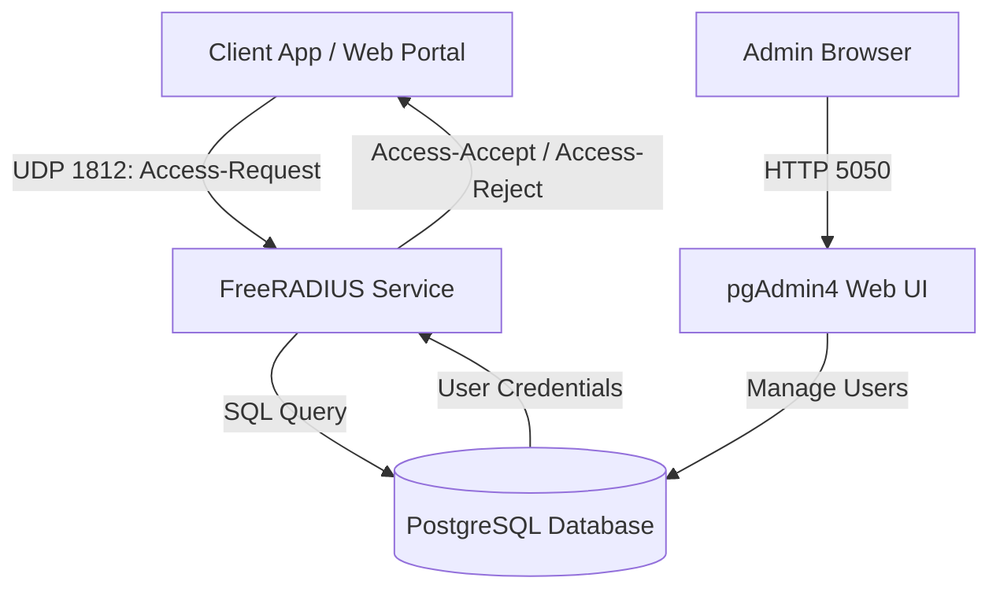

# Centralized SSO Authentication System (FreeRADIUS + PostgreSQL)

[🇹🇭 **อ่านภาษาไทย (Thai Version)**](README_TH.md)

A lightweight, centralized Single Sign-On (SSO) authentication service powered by **FreeRADIUS** and backed by a **PostgreSQL** database, complete with **pgAdmin 4** for web-based management.

---

## 🏗️ System Architecture



### Services & Port Mappings

| Service | Container Name | Host Port | Internal Docker Host | Credentials / Secret |
| :--- | :--- | :--- | :--- | :--- |
| **FreeRADIUS Auth** | `sso-radius` | `1812/udp` | `sso-radius:1812` | Secret: `sso_secret_123` |
| **PostgreSQL DB** | `sso-postgres` | `5432` | `sso-postgres:5432` | DB: `radius`<br>User: `radius`<br>Pass: `radius_password` |
| **pgAdmin Web UI** | `sso-pgadmin` | `5050` / `5051` | `http://localhost:5050` | Email: `admin@example.com`<br>Pass: `admin_password` |

---

## 🚀 Quick Start

### 1. Start System Containers
Run the following command to build and launch all services:

```bash
docker-compose up -d --build
```

### 2. Verify Running Services
```bash
docker ps
```

---

## 👥 User Management (How to Add Users)

Users are stored in the PostgreSQL database in a single `users` table.

### Option A: Via pgAdmin Web UI

1. Open **[http://localhost:5050](http://localhost:5050)** in your browser.
2. Log in with **`admin@example.com`** / **`admin_password`**.
3. In the left panel, navigate to:
   **Servers** ➡️ **SSO Database (radius)** ➡️ **Databases** ➡️ **radius** ➡️ **Schemas** ➡️ **public** ➡️ **Tables** ➡️ **`users`**.
4. Right-click **`users`** ➡️ **View/Edit Data** ➡️ **All Rows**.
5. Add new row entries for `username` and `password`, then click **Save** (F6).

---

### Option B: Via SQL Queries

You can execute SQL queries directly inside the database container.

#### 1. Add a Plaintext Password User
```bash
docker exec -it sso-postgres psql -U radius -d radius -c "
INSERT INTO users (username, password) VALUES ('newuser', 'userpassword123');
"
```

#### 2. Add a Bcrypt Hashed Password User
```bash
docker exec -it sso-postgres psql -U radius -d radius -c "
INSERT INTO users (username, password) VALUES ('ชื่อผู้ใช้', crypt('รหัสผ่าน', gen_salt('bf')));
"
```

> 💡 **Note:** FreeRADIUS automatically detects whether the password is stored as plaintext or bcrypt-hashed and authenticates accordingly!

---

## 🔐 How Authentication Works

### RADIUS Packet Request (`Access-Request`)
When an application wants to authenticate a user, it sends a RADIUS `Access-Request` packet to FreeRADIUS on **UDP Port 1812** containing:
- **`User-Name`**: The username string (e.g. `john`)
- **`User-Password`**: The cleartext password supplied by the end-user
- **`NAS-IP-Address`**: Client/Application IP address
- **Shared Secret**: Shared key used to encrypt the payload (`sso_secret_123`)

---

### Response Statuses (`Access-Accept` vs `Access-Reject`)

| Status | Meaning | What to do in your Application |
| :--- | :--- | :--- |
| **`Access-Accept`** | **Authentication Successful** | Grant user access / issue session cookie or JWT token. |
| **`Access-Reject`** | **Authentication Failed** | Deny access, display error message ("Invalid username or password"). |

---

## 🧪 Testing Authentication (`radtest`)

You can test user authentication directly from your terminal using `radtest`:

```bash
# Test Plaintext User (john)
docker exec -it sso-radius radtest john password123 127.0.0.1 0 sso_secret_123

# Test Hashed (Bcrypt) User (alice)
docker exec -it sso-radius radtest alice alicepassword123 127.0.0.1 0 sso_secret_123
```

#### Example Output on Success (`Access-Accept`):
```text
Sent Access-Request Id 92 from 0.0.0.0:44124 to 127.0.0.1:1812 length 74
	User-Name = "john"
	User-Password = "password123"
Received Access-Accept Id 92 from 127.0.0.1:1812 to 127.0.0.1:44124 length 72
```

---

## 💻 Integration Guide for Application Teams

Other application teams (Web Apps, APIs, Gateways) can connect to this SSO service using any standard RADIUS client library.

### Client Configuration Values

* **RADIUS Host**: `sso-radius` (if inside Docker) or `localhost` / `your-server-ip`
* **Port**: `1812` (UDP)
* **Shared Secret**: `sso_secret_123`

---

### Code Examples

#### 🐍 Python Example (`pyradius` / `pyrad`)

```python
from pyrad.client import Client
from pyrad.dictionary import Dictionary
import pyrad.packet

# Configure RADIUS Client
srv = Client(server="localhost", authport=1812, secret=b"sso_secret_123", dict=Dictionary("dictionary"))

# Create Authentication Request
req = srv.CreateAuthPacket(code=pyrad.packet.AccessRequest, User_Name="john")
req["User-Password"] = req.PwCrypt("password123")

try:
    reply = srv.SendPacket(req)
    if reply.code == pyrad.packet.AccessAccept:
        print("✅ Authentication Success: Access Granted")
    else:
        print("❌ Authentication Failed: Invalid Credentials")
except Exception as e:
    print(f"⚠️ RADIUS Server Error: {e}")
```

#### 🟨 Node.js Example (`radius` npm package)

```javascript
const radius = require('radius');
const dgram = require('dgram');

const secret = 'sso_secret_123';
const client = dgram.createSocket('udp4');

const packet = radius.encode({
  code: 'Access-Request',
  secret: secret,
  attributes: [
    ['User-Name', 'john'],
    ['User-Password', 'password123']
  ]
});

client.on('message', (msg) => {
  const response = radius.decode({ packet: msg, secret: secret });
  if (response.code === 'Access-Accept') {
    console.log('✅ Auth Success!');
  } else {
    console.log('❌ Auth Failed!');
  }
  client.close();
});

client.send(packet, 0, packet.length, 1812, 'localhost');
```

---

## 📜 Log Inspection & Debugging

To view live FreeRADIUS debug logs:

```bash
docker logs -f sso-radius
```

To view database logs:

```bash
docker logs -f sso-postgres
```
